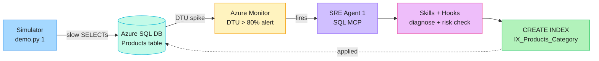
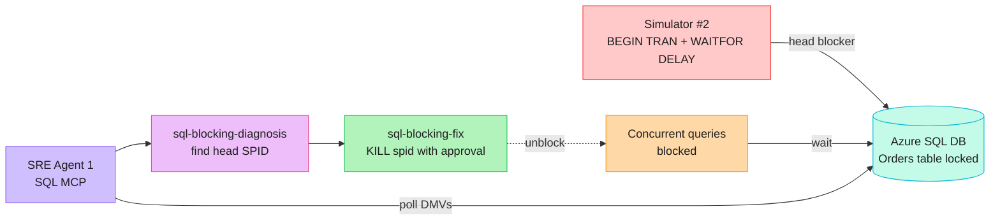
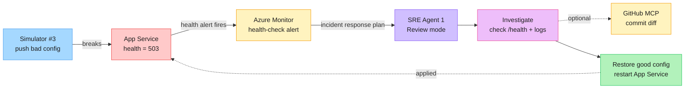

# Azure Friday — SRE Agent Demo Lab

Deploy a realistic e-commerce platform ("Zava"), break it on purpose, and watch **Azure SRE Agent** detect, diagnose, and remediate. Built for the Scott Hanselman Azure Friday demo.

> **Audience:** Azure infrastructure engineers. You'll run scripts and click through the SRE Agent portal — no app dev work required.

---

## What gets deployed

```
┌─────────────────────────────────────────────────────────┐
│           Resource Group: rg-zava-<suffix>              │
│                                                         │
│  App Service Plan (Linux, S2 Standard)                  │
│   ├─ app-zava-<suffix>            .NET 8 storefront API │
│   ├─ app-zava-<suffix>-itportal   Node 20 IT portal     │
│   └─ app-zava-<suffix>-warranty   Python 3.12 warranty  │
│                                                         │
│  Azure SQL Server + DB (Basic, 5 DTU)                   │
│  Application Insights + Log Analytics                   │
│  Azure Monitor alert rules:                             │
│    • alert-<prefix>-dtu-high       (DTU > 80%)          │
│    • alert-<prefix>-http-5xx       (HTTP 5xx errors)    │
│    • alert-<prefix>-health-check   (probe failures)     │
│  Azure Portal dashboard                                 │
└─────────────────────────────────────────────────────────┘
```

**Not deployed by Bicep:** the Azure SRE Agent itself. It is created in the portal — see [Part 2](#part-2--create-the-sre-agent-portal-step) below.

---

## Prerequisites

| Tool | Version | Install |
|------|---------|---------|
| Azure CLI | 2.60+ | `winget install Microsoft.AzureCLI` |
| PowerShell | 7+ | `winget install Microsoft.PowerShell` |
| Bicep | bundled with az | `az bicep install` |
| .NET SDK | 8+ | `winget install Microsoft.DotNet.SDK.8` |
| Python | 3.11+ | `winget install Python.Python.3.12` |
| SRE Agent CLI | latest | `dotnet tool install sreagent.cli --global` |

You also need:

- An Azure **tenant ID** and **subscription ID** with Owner or Contributor.
- *(Scenario 3 deeper analysis only)* A GitHub fine-grained PAT with `repo` read.
- *(Scenario 4 only)* A free [ServiceNow PDI](https://developer.servicenow.com/). Skip if you only run Scenarios 1–3.

> **Note:** `srectl` is installed by the `sreagent.cli` .NET global tool, not winget/choco. If `dotnet tool install sreagent.cli --global` cannot find the package, open the SRE Agent portal's **CLI** link and confirm any required package source. The repo works without `srectl` — the helper script falls back to validate-only mode.

---

## Part 1 — Deploy the infrastructure

The deployment is fully automated. Pick **one** of the two paths below.

### Path A — Agent-driven (recommended)

Open [`deployment_plan.md`](deployment_plan.md) in VS Code and hand it to the assistant. It asks for **tenant ID + subscription ID only**, then executes Steps 1–11:

1. `az login` to your tenant + subscription.
2. Picks a region with App Service + SQL capacity.
3. Generates a unique 6-char suffix (e.g. `a1b2c3`).
4. Deploys `infra/main.bicep`.
5. Seeds SQL (`infra/seed-database.sql`).
6. Zip-deploys all three apps.
7. Validates every resource + endpoint.
8. Hands off to Part 2 below.

Watch the runbook output for your `Prefix` and `ResourceGroup` values — you'll reuse them in Parts 2–3.

### Path B — Run the script directly

```powershell
$Suffix = -join ((48..57) + (97..102) | Get-Random -Count 6 | ForEach-Object { [char]$_ })
$Prefix = "zava-$Suffix"
$ResourceGroup = "rg-$Prefix"

az login --tenant <tenant-id>
az account set --subscription <subscription-id>
az group create -n $ResourceGroup -l centralus

./infra/deploy.ps1 -ResourceGroup $ResourceGroup -Location centralus -Prefix $Prefix
```

`deploy.ps1` prompts for the SQL admin password if you run it directly. The agent-driven `deployment_plan.md` path may generate a transient password and intentionally does not write it to disk or print it. If you do not know the current SQL password when configuring the SQL MCP connector, reset it before Part 2.

To reset it safely without echoing the value in your terminal history:

```powershell
$Secure = Read-Host "New SQL admin password" -AsSecureString
$Bstr = [Runtime.InteropServices.Marshal]::SecureStringToBSTR($Secure)
$SqlPassword = [Runtime.InteropServices.Marshal]::PtrToStringBSTR($Bstr)

az sql server update -g $ResourceGroup -n "sql-$Prefix" --admin-password $SqlPassword

$ConnectionString = "Server=tcp:sql-$Prefix.database.windows.net,1433;Database=sqldb-$Prefix;User ID=sqladmin;Password=$SqlPassword;Encrypt=True;TrustServerCertificate=False;"
az webapp config connection-string set -g $ResourceGroup -n "app-$Prefix" --connection-string-type SQLAzure --settings DefaultConnection="$ConnectionString"
az webapp restart -g $ResourceGroup -n "app-$Prefix"

[Runtime.InteropServices.Marshal]::ZeroFreeBSTR($Bstr)
Remove-Variable SqlPassword, ConnectionString, Secure, Bstr
```

Use the same new password as `DB_PASSWORD` in the SQL MCP connector.

### Verify

```powershell
curl "https://app-$Prefix.azurewebsites.net/health"            # → {"status":"healthy",...}
curl "https://app-$Prefix.azurewebsites.net/api/products"      # → [{"id":1,...}, ...]
curl "https://app-$Prefix-warranty.azurewebsites.net/health"   # → {"status":"healthy"}
```

---

## Part 2 — Create the SRE Agent (portal step)

Azure SRE Agent has **no ARM / Bicep / `az` creation path** today. You'll create it in the portal and attach it to the resource group you just deployed.

### Step 1 — Create Agent 1 (covers Scenarios 1–3)

1. Browse to **<https://sre.azure.com>**.
2. Click **Create Agent**.
3. On **Basics**, fill in:

    | Field | Value |
    |-------|-------|
    | Subscription | the subscription used in Part 1 |
    | Resource group | `rg-zava-<suffix>` from Part 1 |
    | Agent name | `zava-sreagent-1` |
    | Region | choose an SRE Agent supported region shown in the portal. It can be different from the workload region. |
    | Model provider | `Anthropic (3x)` is preferred for the demo. Choose `Azure OpenAI (1x)` if your tenant/data-boundary policy requires it. |
    | Application Insights | **Use existing** |
    | Application Insights subscription | the subscription used in Part 1 |
    | Application Insights name | `ai-<prefix>` |

    The Bicep deployment already creates Application Insights as `ai-<prefix>` and connects all three apps to it, so you do **not** need the SRE Agent wizard to create a second one. If `ai-<prefix>` is not listed, first confirm the Application Insights subscription is the same subscription from Part 1. Use **Create new** only if your SRE Agent tenant does not allow selecting the demo App Insights resource.
4. Click **Next**, review the settings, then click **Deploy**.
5. Wait for provisioning to finish.
6. If the **More context. Better investigations.** screen appears:
   - Click **Azure resources** and add/select `rg-zava-<suffix>`.
   - Click **Logs** and select the demo Log Analytics / App Insights resources if shown.
   - Click **Code** if you want Scenario 3 to inspect this GitHub repo.
   - Click **Done and go to agent** when finished.

If the agent opens an onboarding chat and asks what these apps do, paste this:

```text
This is the Zava Azure Friday SRE Agent demo environment. The three web apps are one demo product:
- app-<prefix>: .NET 8 storefront API with /health and /api/products.
- app-<prefix>-itportal: Node.js IT support portal.
- app-<prefix>-warranty: Python warranty lookup API.

The main workload is app-<prefix> backed by Azure SQL Database sqldb-<prefix> on sql-<prefix>. Scenarios 1-3 intentionally create SQL performance, SQL blocking, and bad deployment failures so you can diagnose and remediate them.

Use Azure Monitor alerts, Application Insights, Log Analytics, and the SQL MCP connector to investigate the demo. The preferred behavior is to explain findings clearly, ask before risky changes, and validate health after remediation.
```

The portal may not show an Agent ID during this flow. That is OK. You only need the Agent ID if you plan to use `srectl` to apply repo config from the command line. If the portal later shows the agent's **ARM resource ID**, use that full value as the SRE Agent context/ID, for example `/subscriptions/<sub>/resourceGroups/<rg>/providers/Microsoft.App/agents/<agent-name>`. Do not use a conversation/thread ID from an agent chat URL. For a portal-only setup, continue with Step 2.

### Step 2 — Attach the SQL MCP connector (required for Scenarios 1 & 2)

The **Capabilities → Tools** page shows tools that are already connected. If it says **No MCP servers + services found**, add the connector first:

1. Go to **Builder → Connectors**.
2. Click **+ Add connector**.
3. Choose **MCP Server**.
4. Choose **stdio** / local process if prompted for transport.
5. Fill in:

   | Field | Value |
   |-------|-------|
   | Name / connection ID | `zava-sql` |
   | Command | `npx` |
   | Arguments | Add two argument rows: `-y` and `mssql-mcp@latest` |

   Do not put `-y mssql-mcp@latest` in one row. The portal passes each row as one argument, and `npx` fails if both values are combined.

6. Add these environment variables:

   | Variable | Value |
   |----------|-------|
   | `DB_SERVER` | `sql-<prefix>.database.windows.net` |
   | `DB_DATABASE` | `sqldb-<prefix>` |
   | `DB_USER` | `sqladmin` |
   | `DB_PASSWORD` | the SQL admin password you entered during deployment, or the new password you reset above |
   | `DB_PORT` | `1433` |
   | `DB_ENCRYPT` | `true` |
   | `DB_TRUST_SERVER_CERTIFICATE` | `false` |

   Example for a deployment with prefix `zava-lv514c`:

   | Variable | Value |
   |----------|-------|
   | `DB_SERVER` | `sql-zava-lv514c.database.windows.net` |
   | `DB_DATABASE` | `sqldb-zava-lv514c` |
   | `DB_USER` | `sqladmin` |

7. For **Managed identity**, choose **None** if the portal keeps that value. If the portal changes it back to **System assigned**, leave it there. This MCP server still uses SQL authentication from the `DB_*` environment variables; the managed identity is only the agent identity used to host/run the connector process.

8. Save/add the connector and wait for status **Connected**. In **Builder → Connectors**, you should see `zava-sql` with a green **Connected** status.
9. When the tool picker appears, select these SQL tools:
   - `mssql_connection_status`
   - `mssql_list_schema_objects`
   - `mssql_describe_table_columns`
   - `mssql_read_table_rows`
   - `mssql_run_sql_query`
   - `mssql_execute_stored_procedure`

   `mssql_run_sql_query` is needed because Scenario 1 creates an index and Scenario 2 may kill a blocking session. Keep the agent in approval mode for risky SQL changes.
10. Go back to **Capabilities → Tools → MCP servers + services**. You should now see `zava-sql` and several active SQL tools.

If you reset the SQL password after deployment, update the main app connection string as shown in Part 1 so `/health` continues to work.

### Step 3 — Attach the GitHub MCP connector (optional, Scenario 3)

You do **not** need GitHub for Scenarios 1 and 2. Add it only if you want Scenario 3 to inspect recent repo changes during a bad deployment investigation.

With GitHub connected, the SRE Agent can answer:

- What changed in the last commit?
- Did a config or code change line up with the app health failure?
- Which file is the most likely cause of the failed deployment?
- Are there related pull requests, workflow runs, or deployment records?

Without GitHub connected, Scenario 3 can still use Azure Monitor, App Service settings, App Insights, and Log Analytics. It just will not inspect repository history.

#### Create a fine-grained GitHub PAT

1. Go to <https://github.com/settings/personal-access-tokens/new>.
2. Set **Token name** to `zava-sre-agent-demo`.
3. Set **Expiration** to something short, such as 7 or 30 days.
4. Set **Resource owner** to the owner of your fork, for example your GitHub user/org.
5. Under **Repository access**, choose **Only select repositories**.
6. Select only the repo used for the demo, for example `AzureFriday-SREAgent`.
7. Under **Repository permissions**, set:

   | Permission | Access | Why |
   |------------|--------|-----|
   | Contents | Read-only | Lets the agent inspect files and diffs. |
   | Metadata | Read-only | Required by GitHub and automatically included. |
   | Actions | Read-only | Optional; lets the agent inspect workflow runs. |
   | Deployments | Read-only | Optional; lets the agent inspect deployment records. |
   | Pull requests | Read-only | Optional; useful if the demo references PR context. |

8. Click **Generate token**.
9. Copy the token once. GitHub will not show it again.

Treat the PAT like a password. Do not paste it into chat, commit it, screenshot it, or save it in this repo.

#### Save the PAT in SRE Agent

1. In SRE Agent, go to **Builder → Connectors**.
2. Click **+ Add connector**.
3. Choose the **GitHub** connector card under the **MCP** or **Code Repository** category.
4. Paste the PAT when the connector asks for a GitHub token.
5. Name the connection `zava-github` if the portal asks for a name.
6. Save/add the connector and wait for status **Connected**.
7. In the tool picker, select the GitHub tools for repository search, file/content reading, commits, pull requests, and workflow/actions lookup.
8. Go to **Capabilities → Tools** and confirm the GitHub tools are active.

Delete the PAT from GitHub after the demo if you no longer need repo investigation.

### Step 4 — Connect Azure Monitor alerts (Scenarios 1 & 2)

The portal no longer has a separate **Alert Handlers** blade. Azure Monitor alerts are connected as an incident platform.

1. Go to **Builder → Incident platform**.
2. Select **Azure Monitor**.
3. Save the incident platform.
4. If the portal offers a **Quickstart response plan**, enable/create it.
5. Go to **Builder → Incident response plans**.
6. Create or edit a response plan for Azure Monitor alerts:
   - **Incident response plan name:** `zava-response-plan`
   - **Severity:** `All severity`
   - **Title contains:** start with `alert-<prefix>-dtu-high` for Scenario 1.
   - Leave **Title does not contain** empty.
   - Leave **I want a custom response plan** unchecked for the first run.
   - **Agent autonomy:** choose **Review** for the first demo run so the agent proposes SQL changes before applying them.
   - **Run deep investigation:** leave unchecked for the first run.
   - **Alert reinvestigation cooldown:** leave enabled at `3` hours to avoid duplicate investigations during repeated load tests.

   Add `alert-<prefix>-http-5xx` and `alert-<prefix>-health-check` later if you want the same response plan to catch web/app-health failures too. Starting with only the DTU alert keeps Scenario 1 easy to validate.

The Bicep deployment creates these alert rules in `rg-zava-<suffix>`:

- `alert-<prefix>-dtu-high`
- `alert-<prefix>-http-5xx`
- `alert-<prefix>-health-check`

The important one for Scenario 1 is `alert-<prefix>-dtu-high`. Azure SRE Agent scans Azure Monitor every minute and starts an investigation when a matching alert fires.

If alerts do not appear later, verify that the agent's managed identity has **Monitoring Contributor** on the subscription/resource group and that `rg-zava-<suffix>` is included in the agent's managed Azure resources.

### Step 5 — Add the Scenario 3 health-check response plan

The current portal flow does not expose a separate **Triggers** blade. Use Azure Monitor as the trigger source for Scenario 3 too.

1. Go to **Builder → Incident response plans**.
2. Create another response plan:
   - **Incident response plan name:** `zava-health-response-plan`
   - **Severity:** `All severity`
   - **Title contains:** `alert-<prefix>-health-check`
   - Leave **Title does not contain** empty.
   - Leave **I want a custom response plan** unchecked for the first run.
   - **Agent autonomy:** choose **Review**.
   - **Run deep investigation:** leave unchecked for the first run.
   - **Alert reinvestigation cooldown:** leave enabled at `3` hours.
3. Save the response plan.

When Scenario 3 breaks the app's database connection string, `/health` returns 503, App Service health check fails, `alert-<prefix>-health-check` fires, and SRE Agent starts an incident investigation through Azure Monitor.

### Step 6 — Deploy the repo hooks

The repo hooks live in [`sre-config/agent1/hooks/`](sre-config/agent1/hooks/). They are source-controlled safety controls that run after tool calls:

- [`change-risk-assessor`](sre-config/agent1/hooks/change-risk-assessor.yaml) is a prompt hook. It reviews SQL-changing operations for business-hours risk, blast radius, data volume, and explicit approval. It helps the demo show human-in-the-loop governance instead of letting the agent make risky production changes silently.
- [`sql-write-guard`](sre-config/agent1/hooks/sql-write-guard.yaml) is a command hook. It inspects SQL tool input and blocks destructive operations such as `DROP TABLE`, `DROP DATABASE`, `TRUNCATE`, and `DELETE FROM`, while allowing safe reads, `CREATE INDEX`, `KILL`, and `UPDATE STATISTICS`. It gives the SQL remediation scenarios a hard safety rail.

Run the helper to validate the Azure workload and deploy the hooks to Agent 1:

```powershell
./sre-config/setup-scenarios-1-3.ps1 -ResourceGroup $ResourceGroup -Prefix $Prefix
```

The script looks for a single `Microsoft.App/agents` resource in the resource group, reads its `properties.agentEndpoint`, gets an Azure CLI token for `https://azuresre.dev`, and PUTs each YAML file to the SRE Agent data-plane hooks API. If the resource group has multiple SRE Agents, pass the target agent's ARM resource ID explicitly:

```powershell
./sre-config/setup-scenarios-1-3.ps1 `
   -ResourceGroup $ResourceGroup `
   -Prefix $Prefix `
   -SreAgent1Id "/subscriptions/<sub>/resourceGroups/<rg>/providers/Microsoft.App/agents/<agent-name>"
```

If `srectl` is installed, the same helper also applies the remaining repo YAML under `sre-config/agent1/` for skills, custom agents, tools, and scheduled tasks. If `srectl` is not installed, that is OK for Scenarios 1–3: the hooks are still deployed through REST, and the SQL MCP connector plus Azure Monitor response plans are the important runtime pieces.

To verify in the portal, go to **Builder → Hooks** and confirm both hooks exist:

**Hook 1: `change-risk-assessor`**

- **Name:** `change-risk-assessor`
- **Event type:** `Post Tool Use`
- **Activation mode:** `Always`
- **Description:** `AI-powered risk assessment for SQL operations. Evaluates blast radius, business hours, and data sensitivity. Supports human-in-the-loop approval override.`
- **Hook type:** `Prompt`
- **Model:** `Reasoning Fast`
- **Tool matcher:** `.*create_index.*|.*update_data.*|.*delete_data.*|.*insert_data.*`
- **Timeout:** `30`
- **Fail mode:** `Allow`
- **Source:** [`sre-config/agent1/hooks/change-risk-assessor.yaml`](sre-config/agent1/hooks/change-risk-assessor.yaml)

**Hook 2: `sql-write-guard`**

- **Name:** `sql-write-guard`
- **Event type:** `Post Tool Use`
- **Activation mode:** `Always`
- **Description:** `Blocks destructive SQL operations (DROP, DELETE, TRUNCATE) but allows safe DDL (CREATE INDEX) and session management (KILL).`
- **Hook type:** `Command`
- **Tool matcher:** `.*sql.*|.*SQL.*|.*mssql.*`
- **Timeout:** `30`
- **Fail mode:** `Allow`
- **Source:** [`sre-config/agent1/hooks/sql-write-guard.yaml`](sre-config/agent1/hooks/sql-write-guard.yaml)

Manual fallback: if the REST call fails, create the hooks in **Builder → Hooks** and copy only the `prompt: |` block for `change-risk-assessor` and only the `script: |` block for `sql-write-guard`. Do not paste the full YAML file into either portal field.

The broader [`sre-config/agent1/`](sre-config/agent1/) folder also contains skills, custom-agent YAML, tools, and scheduled tasks for source control. Those make the demo richer when `srectl` is available, but the hooks above are the core governance layer for safe SQL remediation.

---

## Part 3 — Run the demos

Each scenario is one command. Watch the activity feed at <https://sre.azure.com> while it runs.

### One-time simulator setup

```powershell
python -m venv .venv
.\.venv\Scripts\Activate.ps1
pip install -r simulator/requirements.txt

# Reuse $Prefix / $ResourceGroup from Part 1
$env:ZAVA_RESOURCE_GROUP = $ResourceGroup
$env:ZAVA_SQL_SERVER     = "sql-$Prefix.database.windows.net"
$env:ZAVA_SQL_DATABASE   = "sqldb-$Prefix"
$env:ZAVA_SQL_USER       = "sqladmin"
$env:ZAVA_SQL_PASSWORD   = "<sql password from Part 1>"
$env:ZAVA_APP_NAME       = "app-$Prefix"
$env:ZAVA_APP_URL        = "https://app-$Prefix.azurewebsites.net"
$env:ZAVA_DTU_ALERT_NAME = "alert-$Prefix-dtu-high"

# Scenario 3 uses the Azure Monitor health-check alert; no HTTP trigger is required.
```

---

### Scenario 1 — Slow Query (missing index)



> Source: [`docs/diagrams/scenario-1-slow-query.excalidraw`](docs/diagrams/scenario-1-slow-query.excalidraw) — open at <https://excalidraw.com> to edit.

**What breaks.** Simulator drops every index on `Products.Category`, then hammers `SELECT … WHERE Category = @c` until DTU > 80%.

**What the agent does.** DTU alert fires → SRE Agent connects via SQL MCP → `sql-query-diagnosis` finds the missing index → `change-risk-assessor` and `sql-write-guard` approve the DDL → `sql-performance-fix` runs `CREATE NONCLUSTERED INDEX IX_Products_Category`.

**Run:**

```powershell
python simulator/demo.py 1
```

**Watch for (2–5 min):**

1. Simulator shows query latency ~800–2000 ms.
2. Azure Portal → Monitor → Alerts: `alert-<prefix>-dtu-high` fires.
3. SRE Agent activity feed shows skills running.
4. Simulator detects `IX_Products_Category` and prints before/after.
5. Latency drops to ~5 ms.

---

### Scenario 2 — Blocking Chain



> Source: [`docs/diagrams/scenario-2-blocking-chain.excalidraw`](docs/diagrams/scenario-2-blocking-chain.excalidraw)

**What breaks.** Simulator opens `BEGIN TRAN` + `UPDATE Orders` + `WAITFOR DELAY`, holding locks while concurrent reads pile up behind it.

**What the agent does.** SRE Agent polls `sys.dm_exec_requests` / `sys.dm_tran_locks` via SQL MCP → `sql-blocking-diagnosis` identifies the head blocker → `sql-blocking-fix` kills the offending SPID after risk approval.

**Run:**

```powershell
python simulator/demo.py 2
```

**Watch for:**

1. Simulator reports blocked queries.
2. SRE Agent shows the wait chain and head SPID.
3. Agent kills the head blocker.
4. Blocked queries resume in seconds.

---

### Scenario 3 — Bad Deployment



> Source: [`docs/diagrams/scenario-3-bad-deployment.excalidraw`](docs/diagrams/scenario-3-bad-deployment.excalidraw)

**Prerequisite:** `zava-health-response-plan` exists and matches `alert-<prefix>-health-check`.

**What breaks.** Simulator overwrites the App Service `ConnectionStrings__DefaultConnection` setting with a bad SQL server name and restarts the app. `/health` returns 503.

**What the agent does.** App health check fails → Azure Monitor fires `alert-<prefix>-health-check` → SRE Agent starts an incident investigation → it hits `/health`, sees 503 → checks App Service settings/logs → (optional) inspects recent commits via GitHub MCP → proposes restoring the working connection string → after approval, restarts the app and confirms `/health` returns 200.

**Run:**

```powershell
python simulator/demo.py 3
# At the prompt press [b] to break the config, then watch.
```

**Watch for:**

1. App health → 503.
2. Azure Monitor fires `alert-<prefix>-health-check`.
3. SRE Agent opens an incident investigation in Review mode.
4. Agent proposes restoring the connection string and restarting the app.
5. App health → 200.

---

## Optional — Scenario 4 (ServiceNow Integration)

Requires a free [ServiceNow PDI](https://developer.servicenow.com/) plus a second SRE Agent.

1. Create **Agent 2** at <https://sre.azure.com>, name `zava-sreagent-2`, attach to the same `rg-zava-<suffix>`.
2. Apply Agent 2 config:

   ```powershell
   srectl config set-context /subscriptions/<sub>/resourceGroups/<rg>/providers/Microsoft.App/agents/<agent-2-name>
   srectl apply -f sre-config/agent2/agents/
   srectl apply -f sre-config/agent2/tools/
   ```

3. Set ServiceNow env vars and run `python simulator/demo.py 4`:

   ```powershell
   $env:ZAVA_SN_URL  = "https://dev123456.service-now.com"
   $env:ZAVA_SN_USER = "admin"
   $env:ZAVA_SN_PASS = "<your instance password>"
   ```

---

## Resource links

After Part 1 finishes, bookmark:

| Resource | URL |
|----------|-----|
| Main app | `https://app-<prefix>.azurewebsites.net` |
| IT portal | `https://app-<prefix>-itportal.azurewebsites.net` |
| Warranty API | `https://app-<prefix>-warranty.azurewebsites.net` |
| Azure Portal | <https://portal.azure.com> → `rg-zava-<suffix>` |
| SRE Agent Portal | <https://sre.azure.com> |
| Dashboard | Azure Portal → search "Zava Operations Dashboard" |

---

## Troubleshooting

**DTU alert doesn't fire in Scenario 1**
Basic 5 DTU has tight headroom but the alert needs ~2–5 min of sustained load. Check Azure Portal → Monitor → Alerts. Re-run the simulator and let it run longer.

**Simulator can't reach SQL**
Add your client IP to the SQL firewall:
```powershell
$myIp = (Invoke-WebRequest https://api.ipify.org).Content
az sql server firewall-rule create -g $ResourceGroup -s "sql-$Prefix" -n MyIP --start-ip-address $myIp --end-ip-address $myIp
```

**SRE Agent doesn't activate on an alert**
Confirm the MCP connector status is **Connected**, the alert handler is linked to the right alert rule, and that `setup-scenarios-1-3.ps1` reported success applying skills/hooks/agents.

**`srectl` not found**
Install it with `dotnet tool install sreagent.cli --global`, then reopen PowerShell if your PATH does not pick up .NET global tools immediately. If NuGet cannot find `sreagent.cli`, open the **CLI** link in the SRE Agent portal and confirm any required package source. The setup script still validates the deployment and prints the commands to apply later.

**Connection string drift after Scenario 3**
If Scenario 3 leaves the app broken, restore it manually:
```powershell
az webapp config connection-string set -g $ResourceGroup -n "app-$Prefix" `
  --connection-string-type SQLAzure `
  --settings DefaultConnection="<correct connection string from Bicep output>"
az webapp restart -g $ResourceGroup -n "app-$Prefix"
```

---

## Cleanup

```powershell
az group delete -n $ResourceGroup --yes --no-wait
```

Tears down the demo workload, including `ai-<prefix>` and `law-<prefix>`. Delete the SRE Agent separately from <https://sre.azure.com> if you also want the agent billing to stop.

---

## Cost

| Resource | SKU | Approx / mo |
|----------|-----|-------------|
| Azure SQL DB | Basic 5 DTU | $5 |
| App Service Plan | S2 Standard (3 apps share it) | $73 |
| Log Analytics + App Insights | Pay-as-you-go, 5 GB free | $0 |
| Azure Monitor alerts | Free tier | $0 |
| **Total** | | **~$78/mo** |

SRE Agent is billed separately from the workload at **$0.40/hour per agent** for always-on flow, plus active-flow AAU usage while it investigates. For a 1-hour demo with one agent, expect roughly **under $0.50** for the agent baseline before any extra active-flow tokens.

Delete the resource group and the SRE Agent right after the demo to keep the cost to a few cents.

---

## Repo layout

```
infra/                Bicep + deploy.ps1 + seed-database.sql
src/                  .NET 8 storefront API
laptop-request-site/  Node 20 IT portal
warranty-tool/        Python warranty API
simulator/            demo.py — scenario driver
sre-config/           SRE Agent skills, hooks, agents, helper script
  agent1/             SQL & deployment (Scenarios 1–3)
  agent2/             IT support & ServiceNow (Scenario 4)
deployment_plan.md    Generic agent-driven deployment runbook
dashboard.json        Azure Portal dashboard template
```

---

## License

Demonstration use only. Built for the Azure Friday show.
