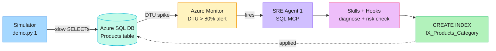
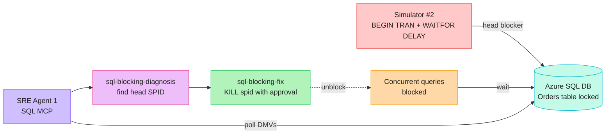
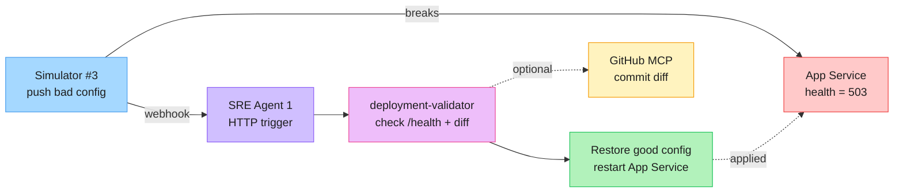

# Azure Friday — SRE Agent Demo Lab

Deploy a realistic e-commerce platform ("Zava"), break it on purpose, and watch **Azure SRE Agent** detect, diagnose, and remediate. Built for the Scott Hanselman Azure Friday demo.

> **Audience:** Azure infrastructure engineers. You'll run scripts and click through the SRE Agent portal — no app dev work required.

---

## What gets deployed

```
┌─────────────────────────────────────────────────────────┐
│           Resource Group: rg-zava-<suffix>              │
│                                                         │
│  App Service Plan (Linux, S2 Standard)                  │
│   ├─ app-zava-<suffix>            .NET 8 storefront API │
│   ├─ app-zava-<suffix>-itportal   Node 20 IT portal     │
│   └─ app-zava-<suffix>-warranty   Python 3.12 warranty  │
│                                                         │
│  Azure SQL Server + DB (Basic, 5 DTU)                   │
│  Application Insights + Log Analytics                   │
│  Azure Monitor alert rules:                             │
│    • alert-<prefix>-dtu-high       (DTU > 80%)          │
│    • alert-<prefix>-http-5xx       (HTTP 5xx errors)    │
│    • alert-<prefix>-health-check   (probe failures)     │
│  Azure Portal dashboard                                 │
└─────────────────────────────────────────────────────────┘
```

**Not deployed by Bicep:** the Azure SRE Agent itself. It is created in the portal — see [Part 2](#part-2--create-the-sre-agent-portal-step) below.

---

## Prerequisites

| Tool | Version | Install |
|------|---------|---------|
| Azure CLI | 2.60+ | `winget install Microsoft.AzureCLI` |
| PowerShell | 7+ | `winget install Microsoft.PowerShell` |
| Bicep | bundled with az | `az bicep install` |
| Python | 3.11+ | `winget install Python.Python.3.12` |

You also need:

- An Azure **tenant ID** and **subscription ID** with Owner or Contributor.
- *(Scenario 3 deeper analysis only)* A GitHub fine-grained PAT with `repo` read.
- *(Scenario 4 only)* A free [ServiceNow PDI](https://developer.servicenow.com/). Skip if you only run Scenarios 1–3.

> **Note:** `srectl` (the SRE Agent CLI) has no winget/choco package today. Install it from the SRE Agent portal's **CLI** link. The repo works without it — the helper script falls back to validate-only mode.

---

## Part 1 — Deploy the infrastructure

The deployment is fully automated. Pick **one** of the two paths below.

### Path A — Agent-driven (recommended)

Open [`deployment_plan.md`](deployment_plan.md) in VS Code and hand it to the assistant. It asks for **tenant ID + subscription ID only**, then executes Steps 1–11:

1. `az login` to your tenant + subscription.
2. Picks a region with App Service + SQL capacity.
3. Generates a unique 6-char suffix (e.g. `a1b2c3`).
4. Deploys `infra/main.bicep`.
5. Seeds SQL (`infra/seed-database.sql`).
6. Zip-deploys all three apps.
7. Validates every resource + endpoint.
8. Hands off to Part 2 below.

Watch the runbook output for your `Prefix` and `ResourceGroup` values — you'll reuse them in Parts 2–3.

### Path B — Run the script directly

```powershell
$Suffix = -join ((48..57) + (97..102) | Get-Random -Count 6 | ForEach-Object { [char]$_ })
$Prefix = "zava-$Suffix"
$ResourceGroup = "rg-$Prefix"

az login --tenant <tenant-id>
az account set --subscription <subscription-id>
az group create -n $ResourceGroup -l centralus

./infra/deploy.ps1 -ResourceGroup $ResourceGroup -Location centralus -Prefix $Prefix
```

`deploy.ps1` generates a random SQL admin password, deploys Bicep, seeds SQL, zip-deploys the apps, and prints the SQL connection-string template at the end. **Capture that output** — you need the password for Part 2.

### Verify

```powershell
curl "https://app-$Prefix.azurewebsites.net/health"            # → {"status":"healthy",...}
curl "https://app-$Prefix.azurewebsites.net/api/products"      # → [{"id":1,...}, ...]
curl "https://app-$Prefix-warranty.azurewebsites.net/health"   # → {"status":"healthy"}
```

---

## Part 2 — Create the SRE Agent (portal step)

Azure SRE Agent has **no ARM / Bicep / `az` creation path** today. You'll create it in the portal and attach it to the resource group you just deployed.

### Step 1 — Create Agent 1 (covers Scenarios 1–3)

1. Browse to **<https://sre.azure.com>**.
2. Click **Create Agent**.
3. On **Basics**, fill in:

    | Field | Value |
    |-------|-------|
    | Subscription | the subscription used in Part 1 |
    | Resource group | `rg-zava-<suffix>` from Part 1 |
    | Agent name | `zava-sreagent-1` |
    | Region | choose an SRE Agent supported region shown in the portal. It can be different from the workload region. |
    | Model provider | `Anthropic (3x)` is preferred for the demo. Choose `Azure OpenAI (1x)` if your tenant/data-boundary policy requires it. |
    | Application Insights | **Use existing** |
    | Application Insights subscription | the subscription used in Part 1 |
    | Application Insights name | `ai-<prefix>` |

    The Bicep deployment already creates Application Insights as `ai-<prefix>` and connects all three apps to it, so you do **not** need the SRE Agent wizard to create a second one. If `ai-<prefix>` is not listed, first confirm the Application Insights subscription is the same subscription from Part 1. Use **Create new** only if your SRE Agent tenant does not allow selecting the demo App Insights resource.
4. Click **Next**, review the settings, then click **Deploy**.
5. Wait for provisioning to finish.
6. If the **More context. Better investigations.** screen appears:
   - Click **Azure resources** and add/select `rg-zava-<suffix>`.
   - Click **Logs** and select the demo Log Analytics / App Insights resources if shown.
   - Click **Code** if you want Scenario 3 to inspect this GitHub repo.
   - Click **Done and go to agent** when finished.

If the agent opens an onboarding chat and asks what these apps do, paste this:

```text
This is the Zava Azure Friday SRE Agent demo environment. The three web apps are one demo product:
- app-<prefix>: .NET 8 storefront API with /health and /api/products.
- app-<prefix>-itportal: Node.js IT support portal.
- app-<prefix>-warranty: Python warranty lookup API.

The main workload is app-<prefix> backed by Azure SQL Database sqldb-<prefix> on sql-<prefix>. Scenarios 1-3 intentionally create SQL performance, SQL blocking, and bad deployment failures so you can diagnose and remediate them.

Use Azure Monitor alerts, Application Insights, Log Analytics, the SQL MCP connector, and the HTTP trigger to investigate the demo. The preferred behavior is to explain findings clearly, ask before risky changes, and validate health after remediation.
```

The portal may not show an Agent ID during this flow. That is OK. You only need the Agent ID if you plan to use `srectl` to apply repo config from the command line. For a portal-only setup, continue with Step 2.

### Step 2 — Attach the SQL MCP connector (required for Scenarios 1 & 2)

The **Capabilities → Tools** page shows tools that are already connected. If it says **No MCP servers + services found**, add the connector first:

1. Go to **Builder → Connectors**.
2. Click **+ Add connector**.
3. Choose **MCP Server**.
4. Choose **stdio** / local process if prompted for transport.
5. Fill in:

  | Field | Value |
  |-------|-------|
  | Name / connection ID | `zava-sql` |
  | Command | `npx` |
  | Arguments | `-y mssql-mcp@latest` |

6. Add these environment variables:

  | Variable | Value |
  |----------|-------|
  | `DB_SERVER` | `sql-<prefix>.database.windows.net` |
  | `DB_DATABASE` | `sqldb-<prefix>` |
  | `DB_USER` | `sqladmin` |
  | `DB_PASSWORD` | `<the SQL password from Part 1>` |
  | `DB_PORT` | `1433` |
  | `DB_ENCRYPT` | `true` |
  | `DB_TRUST_SERVER_CERTIFICATE` | `false` |

7. Save/add the connector and wait for status **Connected**.
8. When the tool picker appears, select these SQL tools:
  - `mssql_connection_status`
  - `mssql_list_schema_objects`
  - `mssql_describe_table_columns`
  - `mssql_read_table_rows`
  - `mssql_run_sql_query`
  - `mssql_execute_stored_procedure`

  `mssql_run_sql_query` is needed because Scenario 1 creates an index and Scenario 2 may kill a blocking session. Keep the agent in approval mode for risky SQL changes.
9. Go back to **Capabilities → Tools → MCP servers + services**. You should now see `zava-sql` and several active SQL tools.

If you lost the SQL password from Part 1, reset it in Azure Portal on `sql-<prefix>` or run `az sql server update --admin-password <new-password>` and use the new password here.

### Step 3 — Attach the GitHub MCP connector (optional, Scenario 3)

| Field | Value |
|-------|-------|
| Package | `@github/github-mcp-server` |
| Env var `GITHUB_PERSONAL_ACCESS_TOKEN` | fine-grained PAT, `repo` read on this fork |

### Step 4 — Wire alert handlers (Scenarios 1 & 2)

In the agent's **Alert Handlers** blade, link these three rules from `rg-zava-<suffix>`:

- `alert-<prefix>-dtu-high`
- `alert-<prefix>-http-5xx`
- `alert-<prefix>-health-check`

The agent now activates automatically when any of them fires.

### Step 5 — Create the HTTP trigger (Scenario 3)

In the agent's **Triggers** blade:

1. **Create HTTP trigger**, name it `bad-deployment`.
2. Copy the **Trigger URL** and **Audience** — you'll set them as env vars in Part 3.

### Step 6 — Apply the skills, hooks, and agents from this repo

The `sre-config/agent1/` folder ships the skills (`sql-query-diagnosis`, `sql-blocking-fix`, …), hooks (`change-risk-assessor`, `sql-write-guard`), and the `deployment-validator` agent. Apply them via the helper script:

```powershell
./sre-config/setup-scenarios-1-3.ps1 `
  -ResourceGroup $ResourceGroup `
  -Prefix $Prefix `
  -HttpTriggerUrl "<trigger-url-from-step-5>"
```

This validates the workload and prints the connector values you need. If `srectl` is installed **and** you found the agent context/ID from the agent's settings or CLI setup page, rerun with `-SreAgent1Id`:

```powershell
./sre-config/setup-scenarios-1-3.ps1 `
  -ResourceGroup $ResourceGroup `
  -Prefix $Prefix `
  -SreAgent1Id "<agent-id-or-srectl-context>" `
  -HttpTriggerUrl "<trigger-url-from-step-5>"
```

If you do not see an Agent ID in the portal, keep going with the portal UI. The ID is not required for Scenarios 1–3 as long as you manually add the SQL MCP connector, alert handlers, and HTTP trigger.

---

## Part 3 — Run the demos

Each scenario is one command. Watch the activity feed at <https://sre.azure.com> while it runs.

### One-time simulator setup

```powershell
python -m venv .venv
.\.venv\Scripts\Activate.ps1
pip install -r simulator/requirements.txt

# Reuse $Prefix / $ResourceGroup from Part 1
$env:ZAVA_RESOURCE_GROUP = $ResourceGroup
$env:ZAVA_SQL_SERVER     = "sql-$Prefix.database.windows.net"
$env:ZAVA_SQL_DATABASE   = "sqldb-$Prefix"
$env:ZAVA_SQL_USER       = "sqladmin"
$env:ZAVA_SQL_PASSWORD   = "<sql password from Part 1>"
$env:ZAVA_APP_NAME       = "app-$Prefix"
$env:ZAVA_APP_URL        = "https://app-$Prefix.azurewebsites.net"
$env:ZAVA_DTU_ALERT_NAME = "alert-$Prefix-dtu-high"

# Scenario 3 only:
$env:ZAVA_SRE_HTTP_TRIGGER_URL      = "<trigger-url-from-Part-2-step-5>"
$env:ZAVA_SRE_HTTP_TRIGGER_AUDIENCE = "<audience-from-Part-2-step-5>"
```

---

### Scenario 1 — Slow Query (missing index)



> Source: [`docs/diagrams/scenario-1-slow-query.excalidraw`](docs/diagrams/scenario-1-slow-query.excalidraw) — open at <https://excalidraw.com> to edit.

**What breaks.** Simulator drops every index on `Products.Category`, then hammers `SELECT … WHERE Category = @c` until DTU > 80%.

**What the agent does.** DTU alert fires → SRE Agent connects via SQL MCP → `sql-query-diagnosis` finds the missing index → `change-risk-assessor` and `sql-write-guard` approve the DDL → `sql-performance-fix` runs `CREATE NONCLUSTERED INDEX IX_Products_Category`.

**Run:**

```powershell
python simulator/demo.py 1
```

**Watch for (2–5 min):**

1. Simulator shows query latency ~800–2000 ms.
2. Azure Portal → Monitor → Alerts: `alert-<prefix>-dtu-high` fires.
3. SRE Agent activity feed shows skills running.
4. Simulator detects `IX_Products_Category` and prints before/after.
5. Latency drops to ~5 ms.

---

### Scenario 2 — Blocking Chain



> Source: [`docs/diagrams/scenario-2-blocking-chain.excalidraw`](docs/diagrams/scenario-2-blocking-chain.excalidraw)

**What breaks.** Simulator opens `BEGIN TRAN` + `UPDATE Orders` + `WAITFOR DELAY`, holding locks while concurrent reads pile up behind it.

**What the agent does.** SRE Agent polls `sys.dm_exec_requests` / `sys.dm_tran_locks` via SQL MCP → `sql-blocking-diagnosis` identifies the head blocker → `sql-blocking-fix` kills the offending SPID after risk approval.

**Run:**

```powershell
python simulator/demo.py 2
```

**Watch for:**

1. Simulator reports blocked queries.
2. SRE Agent shows the wait chain and head SPID.
3. Agent kills the head blocker.
4. Blocked queries resume in seconds.

---

### Scenario 3 — Bad Deployment



> Source: [`docs/diagrams/scenario-3-bad-deployment.excalidraw`](docs/diagrams/scenario-3-bad-deployment.excalidraw)

**Prerequisite:** `ZAVA_SRE_HTTP_TRIGGER_URL` and `ZAVA_SRE_HTTP_TRIGGER_AUDIENCE` env vars set (from Part 2 Step 5).

**What breaks.** Simulator overwrites the App Service `ConnectionStrings__DefaultConnection` setting with a bad SQL server name and restarts the app. `/health` returns 503.

**What the agent does.** Simulator posts to the HTTP trigger → SRE Agent runs `deployment-validator` → it hits `/health`, sees 503 → (optional) inspects recent commits via GitHub MCP → restores the working connection string → restarts the app → confirms `/health` returns 200.

**Run:**

```powershell
python simulator/demo.py 3
# At the prompt press [b] to break the config, then watch.
```

**Watch for:**

1. App health → 503.
2. SRE Agent activity feed shows `deployment-validator` running.
3. Agent restores the connection string and restarts the app.
4. App health → 200.

---

## Optional — Scenario 4 (ServiceNow Integration)

Requires a free [ServiceNow PDI](https://developer.servicenow.com/) plus a second SRE Agent.

1. Create **Agent 2** at <https://sre.azure.com>, name `zava-sreagent-2`, attach to the same `rg-zava-<suffix>`.
2. Apply Agent 2 config:

   ```powershell
   srectl config set-context <agent-2-id>
   srectl apply -f sre-config/agent2/agents/
   srectl apply -f sre-config/agent2/tools/
   ```

3. Set ServiceNow env vars and run `python simulator/demo.py 4`:

   ```powershell
   $env:ZAVA_SN_URL  = "https://dev123456.service-now.com"
   $env:ZAVA_SN_USER = "admin"
   $env:ZAVA_SN_PASS = "<your instance password>"
   ```

---

## Resource links

After Part 1 finishes, bookmark:

| Resource | URL |
|----------|-----|
| Main app | `https://app-<prefix>.azurewebsites.net` |
| IT portal | `https://app-<prefix>-itportal.azurewebsites.net` |
| Warranty API | `https://app-<prefix>-warranty.azurewebsites.net` |
| Azure Portal | <https://portal.azure.com> → `rg-zava-<suffix>` |
| SRE Agent Portal | <https://sre.azure.com> |
| Dashboard | Azure Portal → search "Zava Operations Dashboard" |

---

## Troubleshooting

**DTU alert doesn't fire in Scenario 1**
Basic 5 DTU has tight headroom but the alert needs ~2–5 min of sustained load. Check Azure Portal → Monitor → Alerts. Re-run the simulator and let it run longer.

**Simulator can't reach SQL**
Add your client IP to the SQL firewall:
```powershell
$myIp = (Invoke-WebRequest https://api.ipify.org).Content
az sql server firewall-rule create -g $ResourceGroup -s "sql-$Prefix" -n MyIP --start-ip-address $myIp --end-ip-address $myIp
```

**SRE Agent doesn't activate on an alert**
Confirm the MCP connector status is **Connected**, the alert handler is linked to the right alert rule, and that `setup-scenarios-1-3.ps1` reported success applying skills/hooks/agents.

**`srectl` not found**
Install it from the **CLI** link in the SRE Agent portal. No winget/choco package today. The setup script still validates the deployment and prints the commands to apply later.

**Connection string drift after Scenario 3**
If Scenario 3 leaves the app broken, restore it manually:
```powershell
az webapp config connection-string set -g $ResourceGroup -n "app-$Prefix" `
  --connection-string-type SQLAzure `
  --settings DefaultConnection="<correct connection string from Bicep output>"
az webapp restart -g $ResourceGroup -n "app-$Prefix"
```

---

## Cleanup

```powershell
az group delete -n $ResourceGroup --yes --no-wait
```

Tears down the demo workload, including `ai-<prefix>` and `law-<prefix>`. Delete the SRE Agent separately from <https://sre.azure.com> if you also want the agent billing to stop.

---

## Cost

| Resource | SKU | Approx / mo |
|----------|-----|-------------|
| Azure SQL DB | Basic 5 DTU | $5 |
| App Service Plan | S2 Standard (3 apps share it) | $73 |
| Log Analytics + App Insights | Pay-as-you-go, 5 GB free | $0 |
| Azure Monitor alerts | Free tier | $0 |
| **Total** | | **~$78/mo** |

SRE Agent is billed separately from the workload at **$0.40/hour per agent** for always-on flow, plus active-flow AAU usage while it investigates. For a 1-hour demo with one agent, expect roughly **under $0.50** for the agent baseline before any extra active-flow tokens.

Delete the resource group and the SRE Agent right after the demo to keep the cost to a few cents.

---

## Repo layout

```
infra/                Bicep + deploy.ps1 + seed-database.sql
src/                  .NET 8 storefront API
laptop-request-site/  Node 20 IT portal
warranty-tool/        Python warranty API
simulator/            demo.py — scenario driver
sre-config/           SRE Agent skills, hooks, agents, helper script
  agent1/             SQL & deployment (Scenarios 1–3)
  agent2/             IT support & ServiceNow (Scenario 4)
deployment_plan.md    Generic agent-driven deployment runbook
dashboard.json        Azure Portal dashboard template
```

---

## License

Demonstration use only. Built for the Azure Friday show.
